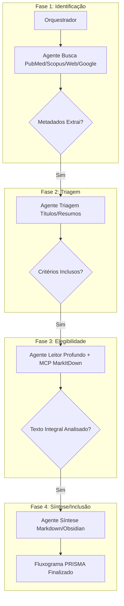

# 🧬 Agents-Prisma: Sistema Multi-Agente para Revisões Sistemáticas PRISMA

## Visão Geral

Um sistema automatizado de **revisões sistemáticas** baseado na metodologia **PRISMA** (Preferred Reporting Items for Systematic Reviews and Meta-Analyses), utilizando uma arquitetura multi-agentes com **CrewAI**.

### Objetivo Principal
Automatizar o processo completo de revisão sistemática, desde a busca em bases de dados científicas até a síntese dos resultados finais, seguindo os 4 estágios obrigatórios do PRISMA:

1. **Identificação** → Busca em PubMed/Medline, Scopus, Web of Science, Google Scholar
2. **Triagem** → Filtragem baseada em critérios de inclusão/exclusão
3. **Elegibilidade** → Análise profunda do texto integral (PDFs via MCP)
4. **Síntese/Inclusão** → Formatação para consumo (Markdown/Obsidian)

---

## 🏗️ Arquitetura Multi-Agentes (CrewAI)

### Agentes Principais

| Agente | Responsabilidade | Fase PRISMA | Status |
|--------|------------------|-------------|--------|
| **Orquestrador** | Gerencia estado e fluxo do funil de revisão | Todas | ✅ Definido |
| **Agente de Busca** | Extrai metadados das bases científicas | 1 - Identificação | ✅ Definido |
| **Agente de Triagem** | Filtra resumos/títulos com critérios | 2 - Triagem | ✅ Definido |
| **Agente Leitor Profundo** | Analisa texto integral via MCP (MarkItDown) | 3 - Elegibilidade | ✅ Definido |
| **Agente de Síntese** | Formata dados para Obsidian/Markdown | 4 - Inclusão/Síntese | ✅ Definido |
| **Agente Fluxograma PRISMA** | Gera fluxograma obrigatório da metodologia | Pós-processamento | 🆕 Adicionado |

### Arquitetura Técnica



---

## 🛠️ Stack Tecnológico

### Core Multi-Agentes
- **Framework:** `CrewAI` (agente autônomo com orquestração)
- **Estado:** Grafos de estado implícitos (workflow pipeline)

### Persistência e Banco de Dados
- **Banco Principal:** PostgreSQL (relacional, produção-ready)
- **Cache Local:** SQLite/Jobs para desenvolvimento rápido
- **Schema Design:** Tabelas normalizadas por fase PRISMA

### Extração e Processamento de PDFs
- **MCP Server:** `MarkItDown` (conversão PDF → Markdown estruturado)
- **Fallback:** `Filesystem MCP` + regex extraction

### Automação Web/Scraping
- **Bases Integradas:** PubMed, Medline, Scopus, Web of Science, Google Scholar
- **APIs:** RESTful endpoints oficiais das bases científicas

---

## 📁 Estrutura de Projetos (Customizada para PRISMA)

```
Agents-Prisma/
├── .planning/                    # GSD Planning Artifacts
│   ├── PROJECT.md               # Contexto do projeto
│   ├── REQUIREMENTS.md          # Requisitos escopados
│   └── ROADMAP.md               # Estrutura de fases
│
├── src/
│   ├── agents/                  # Agentes CrewAI
│   │   ├── orchestrator.py      # Agente Orquestrador
│   │   ├── searcher.py          # Agente Busca PubMed/etc.
│   │   ├── screener.py          # Agente Triagem
│   │   ├── deep_reader.py       # Agente Leitor Profundo + MCP
│   │   ├── synthesizer.py       # Agente Síntese Markdown
│   │   └── prisma_flowchart.py  # Agente Fluxograma PRISMA
│   │
│   ├── tasks/                   # Tasks CrewAI (por agente)
│   │   ├── identification/      # Fase 1 - Identificação
│   │   ├── screening/           # Fase 2 - Triagem
│   │   ├── eligibility/         # Fase 3 - Elegibilidade
│   │   └── synthesis/           # Fase 4 - Síntese
│   │
│   ├── tools/                   # Ferramentas MCP/Extratoras
│   │   ├── pubmed_tool.py       # API PubMed
│   │   ├── scopus_tool.py       # API Scopus
│   │   ├── web_of_science_tool.py
│   │   ├── google_scholar_tool.py
│   │   └── markitdown_mcp.py    # MCP MarkItDown wrapper
│   │
│   ├── db/                      # PostgreSQL schemas
│   │   ├── models.py            # SQLAlchemy ORM
│   │   └── migrations/          # Alembic migrations
│   │
│   └── config/                  # Configurações
│       ├── crew_config.yaml     # CrewAI configuration
│       └── prisma_criteria.json # Critérios PRISMA personalizáveis
│
├── .planning/research/          # Pesquisa de domínio (opcional)
│   └── SUMMARY.md               # Síntese da pesquisa técnica
│
└── tests/                       # Testes dos agentes e ferramentas
```

---

## 🚀 Roadmap Inicial

### Fase 1: Fundação (MVP + Core)
- [ ] Configurar ambiente CrewAI + PostgreSQL
- [ ] Implementar Agente Orquestrador (estado pipeline PRISMA)
- [ ] Integrar APIs das bases científicas (PubMed, Scopus, Web of Science, Google Scholar)

### Fase 2: Agentes de Triagem e Leitura
- [ ] Agente de Triagem (títulos/resumos → critérios de inclusão/exclusão)
- [ ] MCP MarkItDown para extração de PDFs
- [ ] Agente Leitor Profundo (análise texto integral)

### Fase 3: Síntese e Fluxograma
- [ ] Agente Síntese (formatação Markdown/Obsidian)
- [ ] Agente Fluxograma PRISMA (gráfico gerado dinamicamente)
- [ ] Persistência PostgreSQL completa

### Fase 4: Hardening e Extensões
- [ ] UI/API Design para interação humana
- [ ] Testes automatizados dos agentes
- [ ] Documentação completa + exemplos de uso

---

## 📊 Dados de Entrada/Saída

| Entrada | Formato | Origem |
|---------|---------|--------|
| Query de pesquisa | String | Usuário/API externa |
| Metadados artigos | JSON (DOI, título, autores) | PubMed/Scopus APIs |
| PDFs integrais | Binary/PDF | Download via API ou upload local |

| Saída | Formato | Destino |
|-------|---------|---------|
| Funnel de revisão | Markdown tabela | Obsidian/Notion |
| Fluxograma PRISMA | PNG/SVG/Mermaid | Relatório final |
| Dados sintetizados | JSON/Markdown | Consumo downstream |

---

## 🔄 Estado Atual

- **Projeto Inicializado:** ✅ (via `/gsd:new-project`)
- **Pesquisa Técnica:** 🟡 Em andamento (modo Deep)
- **Requisitos Detalhados:** ⏳ Pendente
- **Roadmap Aprovado:** ⏳ Pendente
- **Execução Fase 1:** ⏳ Aguardando `/gsd:plan-phase 1`

---

## 📝 Próximos Passos

1. **Review do PROJECT.md** → Validação com stakeholder
2. **Pesquisa Completa** → Sintetizar descobertas técnicas
3. **REQUIREMENTS.md** → Requisitos detalhados por agente
4. **ROADMAP.md** → Fases granulares + critérios de sucesso
5. **Execução Fase 1** → Configuração ambiente + Agente Orquestrador

---

*Documento gerado via `/gsd:new-project` com skill `gsd-new-project`*