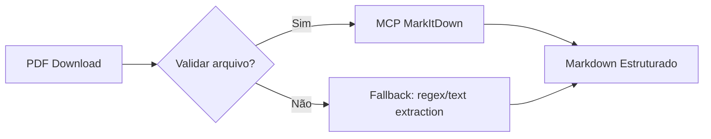
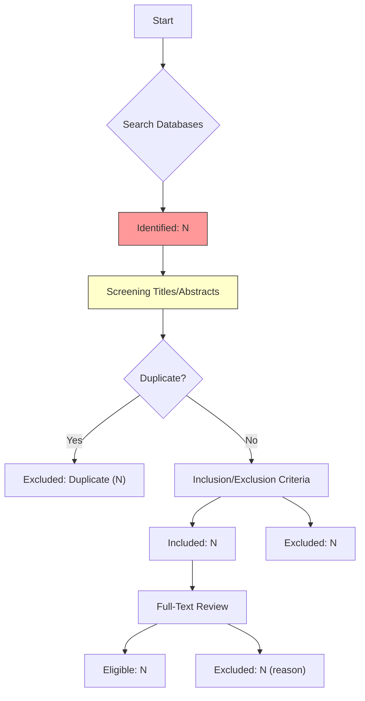

# 📋 Requisitos Detalhados - Agents-Prisma (LangGraph/LangChain)

## Visão Geral dos Requisitos

Este documento detalha os requisitos funcionais, não-funcionais e de qualidade para cada componente do sistema multi-agentes PRISMA com arquitetura **LangGraph + LangChain**.

---

## 1. Requisitos por Agente

### 1.1 Agente Orquestrador (Core)

| ID | Tipo | Descrição | Prioridade |
|----|------|-----------|------------|
| REQ-ORC-01 | Funcional | Gerenciar estado do pipeline PRISMA (4 fases sequenciais) | Alta |
| REQ-ORC-02 | Funcional | Roteamento condicional entre agentes baseado em critérios | Alta |
| REQ-ORC-03 | Não-Funcional | Tempo de decisão < 50ms por transição de fase | Média |
| REQ-ORC-04 | Funcional | Persistência de estado (checkpointing) para reprise após falha | Alta |
| REQ-ORC-05 | Funcional | Logging estruturado JSON de todas as transições | Alta |

#### Sub-requisitos de Estado

```yaml
Pipeline State:
  phases:
    - name: identification
      status: pending/running/completed/error
      artifacts: []
    - name: screening
      status: pending/running/completed/error
      artifacts: []
    - name: eligibility
      status: pending/running/completed/error
      artifacts: []
    - name: synthesis
      status: pending/running/completed/error
      artifacts: []
  
  metadata:
    created_at: ISO8601
    last_updated: ISO8601
    total_articles: int
    included_articles: int
    excluded_articles: int
```

---

### 1.2 Agente de Busca (Fase 1 - Identificação)

| ID | Tipo | Descrição | Prioridade |
|----|------|-----------|------------|
| REQ-BUS-01 | Funcional | Buscar PubMed/Medline via EMBASE API REST | Alta |
| REQ-BUS-02 | Funcional | Buscar Scopus/Web of Science via APIs oficiais | Alta |
| REQ-BUS-03 | Funcional | Buscar Google Scholar via scraping ou API (se disponível) | Média |
| REQ-BUS-04 | Não-Funcional | Suportar queries booleanas complexas (AND, OR, NOT, parentheses) | Alta |
| REQ-BUS-05 | Funcional | Extrair metadados mínimos: DOI, título, autores, ano, periódico | Alta |
| REQ-BUS-06 | Não-Funcional | Retornar máximo 1.000 resultados por base (configurável) | Média |

#### Formato de Saída (Metadados)

```json
{
  "source": "pubmed/scopus/web_of_science/google_scholar",
  "query": "diabetes AND complications",
  "metadata": {
    "doi": "10.xxxx/xxxxx",
    "title": "String completa",
    "authors": ["string"],
    "year": 2024,
    "journal": "string",
    "volume": "int",
    "pages": "string"
  },
  "abstract": "Texto completo do resumo (para fase de triagem)",
  "pdf_url": "URL do PDF oficial ou local_path"
}
```

---

### 1.3 Agente de Triagem (Fase 2)

| ID | Tipo | Descrição | Prioridade |
|----|------|-----------|------------|
| REQ-SCR-01 | Funcional | Ler títulos e resumos dos artigos da Fase 1 | Alta |
| REQ-SCR-02 | Funcional | Aplicar critérios de exclusão rápida (ex: revisão sistemática, metanálise) | Alta |
| REQ-SCR-03 | Funcional | Aplicar critérios de inclusão temática (ex: doença X, intervenção Y) | Alta |
| REQ-SCR-04 | Não-Funcional | Suportar critérios JSON personalizáveis por projeto | Média |
| REQ-SCR-05 | Funcional | Classificar cada artigo como `include`, `exclude` ou `maybe` (triagem manual) | Alta |

#### Critérios Configuráveis (JSON Schema)

```json
{
  "exclusion_criteria": {
    "study_type": ["systematic_review", "meta_analysis", "editorial"],
    "language": ["pt-br", "es", "fr"]
  },
  "inclusion_criteria": {
    "population_keywords": ["diabetes", "hypertension"],
    "intervention_keywords": ["metformin", "lifestyle"],
    "outcome_keywords": ["mortality", "complications"]
  }
}
```

#### Formato de Saída (Triagem)

```json
{
  "article_id": "uuid",
  "decision": "include/exclude/maybe",
  "reason": "Texto justificativo",
  "criteria_matched": ["keyword1", "keyword2"],
  "phase_3_candidates": true/false
}
```

---

### 1.4 Agente Leitor Profundo (Fase 3 - Elegibilidade)

| ID | Tipo | Descrição | Prioridade |
|----|------|-----------|------------|
| REQ-READ-01 | Funcional | Baixar PDFs dos artigos classificados como `include` ou `maybe` na triagem | Alta |
| REQ-READ-02 | Funcional | Converter PDF → Markdown estruturado via MCP MarkItDown | Alta |
| REQ-READ-03 | Funcional | Extrair dados estruturados (PICO: Population, Intervention, Comparison, Outcome) | Alta |
| REQ-READ-04 | Não-Funcional | Lidar com fallback para PDFs corrompidos ou layouts complexos | Média |
| REQ-READ-05 | Funcional | Validar qualidade da extração (texto legível > 80%) | Alta |

#### Fluxo de Extração com MCP



#### Formato de Saída (Dados Estruturados)

```json
{
  "article_id": "uuid",
  "pico": {
    "population": ["string"],
    "intervention": ["string"],
    "comparison": ["string"],
    "outcome": ["string"]
  },
  "risk_of_bias": {
    "selection": "low/unclear/high",
    "confounding": "low/unclear/high"
  },
  "quality_score": float,
  "full_text_summary": "Texto resumido da análise"
}
```

---

### 1.5 Agente Síntese (Fase 4 - Inclusão/Síntese)

| ID | Tipo | Descrição | Prioridade |
|----|------|-----------|------------|
| REQ-SYN-01 | Funcional | Consolidar dados de todos os artigos elegíveis em tabela Markdown | Alta |
| REQ-SYN-02 | Não-Funcional | Formatação compatível com Obsidian/Notion (headers, tabelas, links) | Média |
| REQ-SYN-03 | Funcional | Gerar JSON exportável para consumo downstream (ex: R, Python statsmodels) | Alta |
| REQ-SYN-04 | Não-Funcional | Suportar múltiplos idiomas de saída (en/es/fr/de) | Baixa |

#### Formato de Saída (Markdown - Obsidian Ready)

```markdown
# Revisão Sistemática: Diabetes Mellitus Tipo 2

## Métodos

**Bases de Dados:** PubMed, Scopus, Web of Science, Google Scholar  
**Período:** 2014-2024  
**Linguagem:** Inglês, Espanhol  

**Critérios de Inclusão:**
- Population: Adultos com DM2 (≥18 anos)
- Intervention: Metformina
- Outcome: Mortallidade ou complicações

## Resultados

| Autor | Ano | N | PICO Summary | Risk of Bias |
|-------|-----|---|--------------|--------------|
| Smith et al. | 2023 | 1,250 | Metformina vs placebo → redução mortalidade | Low |
| ... | ... | ... | ... | ... |

## Fluxograma PRISMA

![[PRISMA_Flowchart_Diabetes.png]]

## Dados Exportáveis

\`\`\`json
{
  "total_included": 15,
  "articles": [
    {
      "author": "...",
      "year": ...,
      "pico": {...}
    }
  ]
}
\`\`\`

---
*Gerado automaticamente via Agents-Prisma • Data: YYYY-MM-DD*
```

---

### 1.6 Agente Fluxograma PRISMA (Pós-processamento)

| ID | Tipo | Descrição | Prioridade |
|----|------|-----------|------------|
| REQ-FLOW-01 | Funcional | Gerar fluxograma Mermaid/Graphviz baseado nos dados de triagem | Alta |
| REQ-FLOW-02 | Funcional | Exportar para PNG/SVG via biblioteca (ex: `graphviz`, `mermaid.js`) | Média |
| REQ-FLOW-03 | Não-Funcional | Suportar fluxogramas até 1.000 artigos (performance otimizada) | Baixa |

#### Formato de Saída (Mermaid)



---

## 2. Requisitos de Persistência (PostgreSQL + LangGraph)

### 2.1 Esquema de Tabelas

| Tabela | Propósito | Campos Principais |
|--------|-----------|-------------------|
| `projects` | Controle de projetos revisões | id, name, created_at, status |
| `phases` | Estado por fase PRISMA | project_id, phase_name, status, progress, artifacts_json |
| `articles` | Metadados dos artigos buscados | id, project_id, source, doi, title, authors, year, abstract, pdf_url |
| `screening_results` | Resultados de triagem | article_id, decision (include/exclude/maybe), reason, criteria_matched |
| `eligibility_data` | Dados estruturados da leitura profunda | article_id, pico_json, risk_of_bias_json, quality_score |
| `synthesis_output` | Saída final consolidada | project_id, markdown_content, json_export_url, created_at |
| `langgraph_checkpoints` | Estado LangGraph (Novo!) | id, config JSONB, state JSONB, parent_id, created_at |

### 2.1.1 Tabelas Principais (Existentes)

```sql
-- projects: Controle de projetos revisões sistemáticas
CREATE TABLE projects (
    id UUID PRIMARY KEY DEFAULT gen_random_uuid(),
    name VARCHAR(255) NOT NULL,
    description TEXT,
    status VARCHAR(50) DEFAULT 'active',  -- active/completed/archived
    
    created_at TIMESTAMP DEFAULT CURRENT_TIMESTAMP,
    updated_at TIMESTAMP DEFAULT CURRENT_TIMESTAMP
);

-- phases: Estado por fase PRISMA (4 fases sequenciais)
CREATE TABLE phases (
    id UUID PRIMARY KEY DEFAULT gen_random_uuid(),
    project_id UUID NOT NULL REFERENCES projects(id),
    
    phase_name VARCHAR(100) NOT NULL,  -- identification/screening/eligibility/synthesis
    status VARCHAR(50) DEFAULT 'pending',  -- pending/running/completed/error
    
    progress FLOAT DEFAULT 0.0 CHECK (progress BETWEEN 0 AND 100),
    artifacts_json JSONB,  -- Artifacts específicos da fase
    
    created_at TIMESTAMP DEFAULT CURRENT_TIMESTAMP,
    updated_at TIMESTAMP DEFAULT CURRENT_TIMESTAMP
);

-- articles: Metadados dos artigos buscados (por projeto)
CREATE TABLE articles (
    id UUID PRIMARY KEY DEFAULT gen_random_uuid(),
    project_id UUID NOT NULL REFERENCES projects(id),
    
    source VARCHAR(100) NOT NULL,  -- pubmed/scopus/web_of_science/google_scholar
    
    doi VARCHAR(255) UNIQUE,
    title TEXT NOT NULL,
    authors JSONB,  -- Array de strings: [{"name": "..."}, ...]
    
    year INT CHECK (year BETWEEN 1900 AND 2099),
    journal VARCHAR(255),
    volume INT,
    pages VARCHAR(100),
    
    abstract TEXT,
    pdf_url TEXT,  -- URL oficial ou path local
    
    screening_decision VARCHAR(20) CHECK (screening_decision IN ('include', 'exclude', 'maybe')),
    eligibility_status VARCHAR(50) DEFAULT 'pending',
    
    created_at TIMESTAMP DEFAULT CURRENT_TIMESTAMP,
    updated_at TIMESTAMP DEFAULT CURRENT_TIMESTAMP
);

-- screening_results: Resultados de triagem por lote
CREATE TABLE screening_results (
    id UUID PRIMARY KEY DEFAULT gen_random_uuid(),
    project_id UUID NOT NULL REFERENCES projects(id),
    
    batch_number INT NOT NULL,  -- Batch 1, 2, 3...
    article_count INT NOT NULL,  -- Quantos artigos no batch
    
    results JSONB NOT NULL,  -- Array de resultados por artigo:
        -- [{"article_id": "...", "decision": "include/exclude/maybe", "reason": "..."}]
    
    created_at TIMESTAMP DEFAULT CURRENT_TIMESTAMP
);

-- eligibility_data: Dados estruturados da leitura profunda (PICO)
CREATE TABLE eligibility_data (
    id UUID PRIMARY KEY DEFAULT gen_random_uuid(),
    project_id UUID NOT NULL REFERENCES projects(id),
    
    article_id UUID NOT NULL REFERENCES articles(id),
    
    pico JSONB,  -- {"population": [...], "intervention": [...], "comparison": [...], "outcome": [...]}
    risk_of_bias JSONB,  -- {"selection": "low/unclear/high", "confounding": "low/unclear/high"}
    quality_score FLOAT CHECK (quality_score BETWEEN 0 AND 100),
    
    extracted_by_agent VARCHAR(255) NOT NULL,  -- Track which agent/tool did extraction
    extraction_confidence FLOAT DEFAULT 0.0,
    
    created_at TIMESTAMP DEFAULT CURRENT_TIMESTAMP
);

-- synthesis_output: Saída final consolidada (Markdown + JSON)
CREATE TABLE synthesis_output (
    id UUID PRIMARY KEY DEFAULT gen_random_uuid(),
    project_id UUID NOT NULL REFERENCES projects(id),
    
    output_type VARCHAR(100) NOT NULL,  -- markdown/json/both
    
    content TEXT,  -- Markdown/Obsidian format
    json_export_url TEXT,  -- URL para download ou path local
    
    created_at TIMESTAMP DEFAULT CURRENT_TIMESTAMP
);

-- langgraph_checkpoints: Estado LangGraph (Novo!)
CREATE TABLE langgraph_checkpoints (
    id SERIAL PRIMARY KEY,
    config JSONB NOT NULL DEFAULT '{"thread_id": "main"}',
    parent_id INTEGER REFERENCES langgraph_checkpoints(id),
    state JSONB NOT NULL,  -- Full TypedDict state snapshot
    
    created_at TIMESTAMP DEFAULT CURRENT_TIMESTAMP,
    
    INDEX idx_checkpoint_parent (parent_id),
    INDEX idx_checkpoint_state (state) USING GIN
);

-- Create trigger to auto-save on phase completion
CREATE OR REPLACE FUNCTION save_phase_checkpoint()
RETURNS TRIGGER AS $$
BEGIN
    INSERT INTO langgraph_checkpoints (config, state, parent_id)
    VALUES (NEW.config, NEW.state, COALESCE(
        (SELECT id FROM langgraph_checkpoints WHERE config = NEW.config LIMIT 1), NULL
    ));
    RETURN NEW;
END;
$$ LANGUAGE plpgsql;

CREATE TRIGGER save_on_phase_complete
AFTER UPDATE ON phases
FOR EACH ROW
WHEN (NEW.status = 'completed')
EXECUTE FUNCTION save_phase_checkpoint();
```

### 2.1.2 Tabelas LangGraph (Novo!)

| Tabela | Campos Principais | Propósito |
|--------|-------------------|-----------|
| `langgraph_checkpoints` | id, config JSONB, state JSONB, parent_id, created_at | Estado persistido após cada nó completar |
| `langgraph_conversations` | project_id, phase, node_name, messages[], created_at | Histórico de conversas LLM por fase |

### 2.1.3 Relações e Constraints

```sql
-- projects (1) ----< phases (N)
CREATE INDEX idx_phases_project ON phases(project_id);

-- projects (1) ----< articles (N)
CREATE INDEX idx_articles_project ON articles(project_id);
CREATE UNIQUE INDEX idx_articles_doi ON articles(doi);
CREATE INDEX idx_articles_screening ON articles(screening_decision);

-- phases (1) ----< screening_results (N)
CREATE INDEX idx_screening_results_project ON screening_results(project_id);

-- projects (1) ----< eligibility_data (N)
CREATE INDEX idx_eligibility_data_project ON eligibility_data(project_id);

-- synthesis_output (1) ----< project_id (N)
CREATE INDEX idx_synthesis_output_project ON synthesis_output(project_id);

-- langgraph_checkpoints (recursive parent-child)
CREATE INDEX idx_checkpoint_parent ON langgraph_checkpoints(parent_id);
CREATE INDEX idx_checkpoint_state USING GIN(langgraph_checkpoints.state);
```

### 2.1.4 LangGraph Auto-Checkpointing

**Trigger:** `AFTER UPDATE ON phases` → `WHEN (NEW.status = 'completed')`  
**Function:** `save_phase_checkpoint()` inserts state snapshot into `langgraph_checkpoints`.

---

## 3. Requisitos Não-Funcionais Globais (LangGraph + Async I/O)

### 3.1 Performance

| Métrica | Meta | Contexto |
|---------|------|----------|
| Tempo de busca (PubMed) | < 2s para 1.000 resultados | API REST oficial, asyncpg |
| Tempo de triagem (500 artigos) | < 60s total | Batch processamento + LangChain Tools |
| Tempo de extração PDF (30 páginas) | < 10s via MarkItDown | CPU single-threaded |
| Tempo de síntese final | < 5s para projeto completo | Memory optimization |
| Tempo de checkpointing por fase | < 50ms | Async PostgreSQL + JSONB |

### 3.2 Confiabilidade (LangGraph Fault Tolerance)

- **Retry Logic:** Máximo 3 tentativas com backoff exponencial (para APIs externas)
- **Fallback Chains:** MCP → Filesystem → Regex extraction
- **Checkpointing:** Estado salvo a cada nó completar (per-phase persistence via `langgraph_checkpoints`)
- **Logging:** Nível INFO padrão, DEBUG opcional para debugging

### 3.3 Escalabilidade (LangGraph Parallel Execution)

| Cenário | Meta |
|---------|------|
| Projetos paralelos | Máximo 10 projetos simultâneos |
| Artigos por projeto | Até 5.000 artigos (batched processamento, parallel subgraphs) |
| Memória RAM | < 2GB por instância de agente |
| Concurrency | PubMed/Scopus parallel execution (Diamond Pattern) |

---

## 4. Requisitos de Integração Externa

### 4.1 APIs das Bases Científicas

| Base | Endpoint | Autenticação | Rate Limit |
|------|----------|--------------|------------|
| PubMed | `https://eutils.ncbi.nlm.nih.gov/efetch` | API Key opcional (NCBI) | ~30 req/min |
| Scopus | `https://dev.api.elsevier.com/v2/search/articles` | API Key + Client ID | 100 req/min |
| Web of Science | `https://api.clarivate.com/wos/v2/articles` | API Key + Client ID | 60 req/min |
| Google Scholar | Scraping/Custom API | N/A | ~30 req/min |

### 4.2 MCP Servers Externos + LangChain Tools

| MCP Server | Função | Configuração |
|------------|--------|--------------|
| MarkItDown | PDF → Markdown | `markitdown://convert` |
| Filesystem | Arquivos locais | `filesystem://read/write` |
| GitHub/GitLab | Repositórios de código (opcional) | `github://repo`, `gitlab://project` |

### 4.3 LangChain Tools Interface (Novo!)

**Adaptation Pattern:** Wrap existing REST API wrappers (`pubmed_tool.py`, `scopus_tool.py`) as **LangChain Tools**.

```python
from langchain.tools import tool

@tool("query_pubmed")
def query_pubmed(query: str, max_results: int = 50) -> dict:
    """Search PubMed for articles matching the query."""
    # Existing REST API wrapper + LangChain Tool interface
    return {"count": 123, "articles": [...]}

# Register with AgentExecutor
tools = [query_pubmed, query_scopus]
agent = AgentExecutor(agent=..., tools=tools)
```

---

## 5. Requisitos de UX/Interatividade (Fase 4 - Extensão)

### 5.1 Interface Humana-Computador

| ID | Tipo | Descrição | Prioridade |
|----|------|-----------|------------|
| REQ-UX-01 | Funcional | CLI interativa para definir queries e critérios | Média |
| REQ-UX-02 | Não-Funcional | Progresso em tempo real (percentual por fase) | Média |
| REQ-UX-03 | Funcional | Webhook/API para integração com Notion/Obsidian Sync | Baixa |

### 5.2 API REST (Fase 4 - Extensão)

```yaml
Base: https://api.agents-prisma.com/v1

Endpoints:
  POST /projects/{id}/run          # Iniciar pipeline PRISMA completo
  GET  /projects/{id}/status       # Status atual por fase
  GET  /projects/{id}/export/markdown  # Download Markdown
  GET  /projects/{id}/export/json   # Download JSON estruturado
```

---

## 6. Requisitos de Teste e Validação (LangGraph Style)

| ID | Tipo | Descrição | Critério de Aceite |
|----|------|-----------|-------------------|
| REQ-TEST-01 | Funcional | MainStateGraph completa pipeline sequencial | 4 fases concluídas sem erro |
| REQ-TEST-02 | Funcional | Identify/Screen/Read/Synthesize nodes (pure functions) | Unit tests: 8+ cases, all passing |
| REQ-TEST-03 | Funcional | LangChain Tools interface (pubmed/scopus tools) | Tool calling works with AgentExecutor |
| REQ-TEST-04 | Funcional | Parallel execution (PubMed/Scopus subgraphs) | Concurrent processing verified |
| REQ-TEST-05 | Funcional | Auto-checkpointing per phase | State persisted after each node completes |
| REQ-TEST-06 | Não-Funcional | Reprise após falha no meio do pipeline | Estado recomeça da fase anterior |

---

## 7. Critérios de Sucesso (Go/No-Go para Fase 1 + 1.5)

### 7.1 MVP (Mínimo Produto Viável - LangGraph Migration)

✅ **Fase 1.5 aprovada se:**
- [ ] `MainStateGraph` (TypedDict + Pydantic validation, nested by phase)
- [ ] Identify/Screen/Read/Synthesize nodes (pure functions)
- [ ] PubMed/Scopus subgraphs com parallel execution
- [ ] Async PostgreSQL + auto-checkpointing per phase

### 7.2 Core Completo (Fase 1 + 1.5 + 2)

✅ **Core aprovado se:**
- [ ] Todos os requisitos funcionais acima atendidos
- [ ] Agente Triagem classifica ≥90% dos artigos corretamente
- [ ] MCP MarkItDown converte PDFs com qualidade aceitável
- [ ] Reprise após falha funciona sem perda de dados

---

*Documento gerado via `/gsd:new-project` com skill `gsd-new-project`, atualizado para LangGraph/LangChain architecture.*