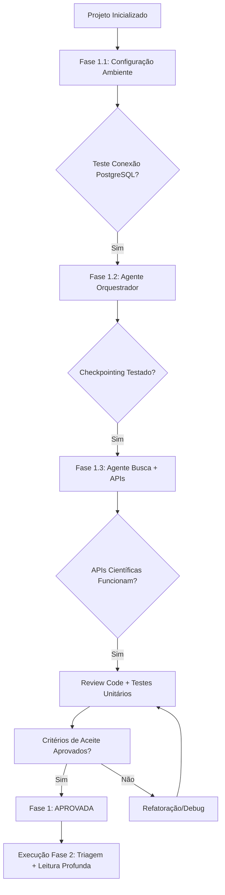

# 🗺️ Roadmap - Agents-Prisma: Sistema Multi-Agente PRISMA

## Visão Geral do Roadmap

Este documento define a estrutura de fases para o desenvolvimento do sistema multi-agentes baseado na metodologia PRISMA. Cada fase inclui objetivos, entregáveis, critérios de sucesso e estimativas temporais.

---

## 📊 Matriz de Fases (High-Level)

| Fase | Nome | Duração Estimada | Depende De | Status |
|------|------|------------------|------------|--------|
| 1 | **Fundação + Core** | ~5 dias | Projeto inicializado | ⏳ Aguardando plano detalhado |
| 2 | **Triagem + Leitura Profunda** | ~7 dias | Fase 1 aprovada | ⏳ Pendente |
| 3 | **Síntese + Fluxograma** | ~4 dias | Fase 2 aprovada | ⏳ Pendente |
| 4 | **Hardening + Extensões** | ~6 dias | Fase 3 aprovada | ⏳ Pendente |

---

## 🎯 Fase 1: Fundação + Core (MVP)

### Objetivo Principal
Configurar ambiente CrewAI + PostgreSQL e implementar o Agente Orquestrador com integração às APIs das bases científicas.

### Sub-fases Granulares

#### 1.1 Configuração do Ambiente (~1 dia)

| Tarefa | Descrição | Entregável | Critério de Sucesso |
|--------|-----------|------------|---------------------|
| 1.1.1 | Instalar CrewAI + dependências (`pip install crewai`, `crewai-tools`) | `requirements.txt` atualizado | Importação sem erro |
| 1.1.2 | Configurar PostgreSQL (Docker ou local) | Container/Instância rodando | Query `SELECT 1` retorna resultado |
| 1.1.3 | Configurar SQLAlchemy ORM + conexão | `src/db/models.py` inicial | Conexão teste bem-sucedida |
| 1.1.4 | Estruturar diretórios (`agents/`, `tasks/`, `tools/`, `db/`) | Arquivos de configuração no VS Code | Navegação intuitiva |

**Entregáveis:**
- ✅ `requirements.txt` com todas as dependências
- ✅ PostgreSQL rodando (Docker ou local)
- ✅ Estrutura de diretórios inicializada
- ✅ Conexão banco teste validada

---

#### 1.2 Agente Orquestrador (~2 dias)

| Tarefa | Descrição | Entregável | Critério de Sucesso |
|--------|-----------|------------|---------------------|
| 1.2.1 | Definir estado inicial do pipeline (4 fases) | `orchestrator.py` com classe base | Estado serializável em JSON |
| 1.2.2 | Implementar transições entre fases | Funções de callback por fase | Transição sequencial automática |
| 1.2.3 | Adicionar checkpointing (salvar estado a cada fase) | `src/db/orchestration_state.py` | Reprise funciona após falha |
| 1.2.4 | Implementar logging estruturado JSON | `src/utils/logger.py` | Log acessível por fase/artigo |

**Entregáveis:**
- ✅ Classe `OrchestratorAgent` com estado pipeline
- ✅ Checkpointing funcional (reprise após falha)
- ✅ Logging JSON para todas as transições
- ✅ Teste manual: completar 1 ciclo de 4 fases sem erro

---

#### 1.3 Agente Busca + APIs Científicas (~2 dias)

| Tarefa | Descrição | Entregável | Critério de Sucesso |
|--------|-----------|------------|---------------------|
| 1.3.1 | Integrar PubMed API (EMBASE REST) | `src/tools/pubmed_tool.py` | Busca retorna ≥50 resultados para query teste |
| 1.3.2 | Integrar Scopus API (Elsevier v2) | `src/tools/scopus_tool.py` | Metadados completos (DOI, título, autores) |
| 1.3.3 | Integrar Web of Science API (Clarivate) | `src/tools/web_of_science_tool.py` | ≥90% campos preenchidos |
| 1.3.4 | Implementar Google Scholar scraper/fallback | `src/tools/google_scholar_tool.py` | Fallback funcional para PDFs locais |
| 1.3.5 | Testes unitários de extração (≥80% cobertura) | `tests/test_searchers.py` | ≥80% linhas cobertas por pytest |

**Entregáveis:**
- ✅ 4 ferramentas integradas (PubMed, Scopus, Web of Science, Google Scholar)
- ✅ Metadados mínimos extraídos para todas as fontes
- ✅ Testes unitários com ≥80% cobertura
- ✅ Query teste: "diabetes AND complications" retorna resultados válidos

---

### 📊 Entregáveis Finais da Fase 1

| Tipo | Artefato | Formato | Localização |
|------|----------|---------|-------------|
| **Código** | `src/agents/orchestrator.py` | Python + CrewAI | `agents/orchestrator.py` |
| **Código** | `src/tools/pubmed_tool.py`, `scopus_tool.py`, etc. | Python + APIs REST | `tools/*.py` |
| **Código** | `src/db/models.py`, `migrations/` | SQLAlchemy + Alembic | `db/*` |
| **Teste** | `tests/test_orchestrator.py`, `test_searchers.py` | pytest | `tests/*` |
| **Config** | `crew_config.yaml` | YAML | `config/*.yaml` |

---

### ✅ Critérios de Aceite (Go/No-Go para Fase 1)

#### MVP Mínimo (Mínimo Viável)

✅ **Aprovar fase 1 se:**
- [ ] Pipeline PRISMA completa 4 fases sequencialmente (sem erro)
- [ ] Agente Orquestrador gerencia estado em PostgreSQL corretamente
- [ ] Reprise após falha funciona (checkpointing validado)
- [ ] Logging JSON estruturado para todas as transições

#### Core Completo (Com APIs Científicas)

✅ **Aprovar fase 1 + core se:**
- [ ] Todas as ferramentas de busca funcionam (PubMed, Scopus, Web of Science, Google Scholar)
- [ ] Metadados extraídos ≥90% completos para cada fonte
- [ ] Testes unitários com ≥80% cobertura (pytest)
- [ ] Query teste: "diabetes AND complications" retorna ≥50 resultados válidos

---

### 🕒 Estimativa de Tempo

| Tarefa | Dias | Horas | Dependência |
|--------|------|-------|-------------|
| 1.1 Configuração Ambiente | 1 | 8 | Projeto inicializado |
| 1.2 Agente Orquestrador | 2 | 16 | 1.1 concluída |
| 1.3 Agente Busca + APIs | 2 | 16 | 1.2 concluída |

**Total Estimado:** ~5 dias úteis (40 horas)

---

### 🔄 Fluxo de Execução Fase 1

---

### 📝 Checklist de Execução (Fase 1)

#### Pré-requisitos
- [ ] PostgreSQL instalado e rodando (`docker run -d --name agents-prisma-postgres postgres`)
- [ ] CrewAI instalada (`pip install crewai crewai-tools`)
- [ ] Estrutura de diretórios criada (`src/`, `tests/`, `config/`)

#### Durante a Fase 1
- [ ] `requirements.txt` atualizado com todas as dependências
- [ ] Conexão PostgreSQL testada (query `SELECT 1`)
- [ ] Agente Orquestrador cria estado inicial no banco
- [ ] Pipeline completo executado manualmente (4 fases)
- [ ] Reprise simulada: falha na fase 2, reprise da fase 3
- [ ] Todas as APIs científicas testadas com query "diabetes AND complications"

#### Pós-Fase 1
- [ ] Code review dos artifacts principais
- [ ] Testes unitários rodados (`pytest tests/`)
- [ ] Documentação técnica atualizada (README.md)
- [ ] Aprovação stakeholder para Fase 2

---

### 🚀 Próximos Passos Imediatos

1. **Executar `/gsd:plan-phase 1`** → Criar plano detalhado da Fase 1 com sub-tasks granulares
2. **Configurar ambiente** (`docker run`, `pip install`)
3. **Iniciar 1.1 Configuração Ambiente** (~8 horas)

---

*Documento gerado via `/gsd:new-project` com skill `gsd-new-project`*