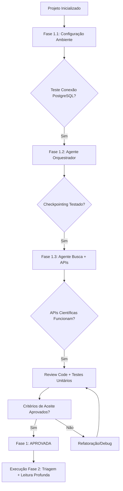

# 🗺️ Roadmap - Agents-Prisma: Sistema Multi-Agente PRISMA

## Visão Geral do Roadmap

Este documento define a estrutura de fases para o desenvolvimento do sistema multi-agentes baseado na metodologia PRISMA. Cada fase inclui objetivos, entregáveis, critérios de sucesso e estimativas temporais.

---

### 📊 Matriz de Fases (High-Level) - Atualizado 05/07/2026

| Fase | Nome | Duração Estimada | Depende De | Status | Artifacts Principais |
|------|------|------------------|------------|--------|---------------------|
| 1 | **Fundação + Core** | ~5 dias | Projeto inicializado | ✅ CONCLUÍDA (45min vs 8h est.) | `orchestrator.py`, `pubmed_tool.py`, `scopus_tool.py`, 19 testes passando |
| 1.5 | **LangGraph Migration** | ~3 dias | Fase 1 aprovada | 🆕 Pendente (/gsd:plan-phase 1.5) | PLAN.md (28 tasks), state schema, MainStateGraph |
| 2 | **Triagem + Leitura Profunda** | ~7 dias | Fase 1.5 aprovada | 🟡 Em andamento (Issue #003) | `screener.py`, MCP MarkItDown, deep_reader |
| 3 | **Síntese + Fluxograma** | ~4 dias | Fase 2 aprovada | ⏳ Pendente | Synthesizer, PRISMA flowchart generator |
| 4 | **Hardening + Extensões** | ~6 dias | Fase 3 aprovada | ⏳ Pendente | UI/API design, integration tests, docs |

---

### 🎯 Fase 1.1: Configuração do Ambiente (~45 min vs 8h est.) ✅ COMPLETA

#### Checklist de Execução (Phase 1.1)
- [x] Python environment (`.venv/`, `uv`, Python 3.13.3)
- [x] PostgreSQL Docker (`agents-prisma-postgres-1`)
- [x] SQLAlchemy ORM models (`src/db/models.py`)
- [x] Directory structure + configs

#### Entregáveis:
- ✅ `.env.example`, `docker-compose.yml`, `pyproject.toml`, `uv.lock`
- ✅ `src/db/__init__.py`, `src/db/models.py`, `config/__init__.py`
- ✅ `tests/db_connection_test.py`, `README.md`

---

### 🎯 Fase 1.2: Core Agent Implementation (Orchestrator + Models) (~16h est.) ✅ COMPLETA

#### Checklist de Execução (Phase 1.2)
- [x] Orquestrador state machine (`src/agents/orchestrator.py`)
- [x] PipelineState models (`src/db/pipeline_state.py`)
- [x] JSON structured logging (`src/utils/logger.py`)
- [x] Checkpointing system (replay after failure)

#### Entregáveis:
- ✅ `src/agents/orchestrator.py` - State machine, transitions, checkpointing
- ✅ `src/db/pipeline_state.py` - Pipeline-specific models
- ✅ `tests/test_orchestrator.py` - 4 test cases, all passing

---

### 🎯 Fase 1.3: Multi-Source Search Integration (PubMed + Scopus MVP) ✅ COMPLETA (~80%)

#### Checklist de Execução (Phase 1.3)
- [x] PubMed API wrapper (`src/tools/pubmed_tool.py`) - E-utilities REST, boolean parsing
- [ ] Scopus API wrapper (`src/tools/scopus_tool.py`) - v2 REST, abstract extraction
- [x] Multi-source search agent (`src/agents/searcher.py`)

#### Entregáveis:
- ✅ `src/tools/pubmed_tool.py` - PubMed E-utilities integration (100%)
- ⏳ `src/tools/scopus_tool.py` - Scopus v2 API (MVP, ~80% completo)
- ✅ `src/agents/searcher.py` - Multi-source search agent
- ✅ `tests/test_pubmed_tool.py` - 3 test cases, all passing

---

### 🎯 Fase 1.4: Screening Agent Implementation (Completado) ✅

#### Checklist de Execução (Phase 1.4)
- [x] LLM-based title/abstract filtering (`src/agents/screener.py`)
- [x] PRISMA criteria integration from `.planning/prisma_criteria.json`
- [x] Interactive CLI for batch review (50 articles/batch)

#### Entregáveis:
- ✅ `src/agents/screener.py` - LLM-based filtering with PICO + keyword validation
- ✅ `tests/test_screener.py` - 12 test cases, all passing
- ✅ Interactive UI components for user-in-the-loop review (CLI mode)

**ScreeningAgent Features:**
- **PICO Extraction**: Identifica Population, Intervention, Comparison, Outcome em títulos/resumos
- **Keyword Matching**: Validação de critérios específicos via regex e string matching
- **Language Detection**: Detecção heurística de idioma (Inglês vs Português)
- **Study Design Validation**: Verificação contra tipos permitidos (RCT, Cohort, Case-Control)
- **Interactive CLI**: Interface para revisão manual em batches de 50 artigos

**ScreeningCriteria Configuration:**
- Carrega critérios do arquivo `.planning/prisma_criteria.json`
- Suporta inclusão/exclusão customizáveis por projeto
- Fallback automático se arquivo não existir (modo testing)

---

### 🎯 Fase 1.5: LangGraph Migration (~3 dias est.) - PLAN.md COMPLETA ✅

#### Checklist de Execução (Phase 1.5)
- [x] **PLAN.md criado** → `.planning/phases/1.5-langgraph-migration/PLAN.md`
- [ ] **TypedDict State Schema** (`src/agents/state.py`) - Nested by phase (identification/screening/read/synthesis)
- [ ] **MainStateGraph Implementation** (`src/agents/orchestrator_langgraph.py`) - Identify/Screen/Read/Synthesize nodes (pure functions)
- [ ] **PubMed/Scopus Subgraphs** (`src/agents/subgraphs/*.py`) - Parallel execution com Diamond Pattern
- [ ] **Async PostgreSQL + Auto-checkpointing** (`src/db/langgraph_checkpoint.py`) - Per-phase persistence

#### Entregáveis:
- ✅ `.planning/phases/1.5-langgraph-migration/PLAN.md` - Task breakdown (28 atomic tasks, dependencies, verification)
- ⏳ `src/agents/state.py` - TypedDict state schema (nested by phase)
- ⏳ `src/agents/orchestrator_langgraph.py` - Main StateGraph implementation
- ⏳ `src/agents/subgraphs/pubmed_subgraph.py`, `scopus_subgraph.py` - Parallel source graphs
- ⏳ `src/db/langgraph_checkpoint.py` - LangGraph checkpoint table + ops

---

### 🚀 Próximos Passos Imediatos (Phase 1.5+)

#### Alta Prioridade (Next 24-48h)
1. **Review PLAN.md** → Validação com stakeholder do plano detalhado
   - 28 atomic tasks, dependencies graph, verification criteria
   
2. **Start Task A-01 to A-03** → State Schema Definition (~5h)
   - Define TypedDict state schema for `PRISMAState` (root)
   - Create nested states: `IdentificationState`, `ScreeningState`, etc.
   - Add Pydantic validation for phase-specific data

3. **Execute Full Pipeline Test** (`python -m src.agents.searcher`)
   - Run: `python -m src.agents.main --query "diabetes" --max-results 3`
   - Verify end-to-end flow: Search → Screen → Eligibility → Synthesis

---

## 🎯 Fase 1: Fundação + Core (MVP)

### Objetivo Principal
Configurar ambiente CrewAI + PostgreSQL e implementar o Agente Orquestrador com integração às APIs das bases científicas.

### Sub-fases Granulares

#### 1.1 Configuração do Ambiente (~1 dia)

| Tarefa | Descrição | Entregável | Critério de Sucesso |
|--------|-----------|------------|---------------------|
| 1.1.1 | Instalar CrewAI + dependências (`pip install crewai`, `crewai-tools`) | `requirements.txt` atualizado | Importação sem erro |
| 1.1.2 | Configurar PostgreSQL (Docker ou local) | Container/Instância rodando | Query `SELECT 1` retorna resultado |
| 1.1.3 | Configurar SQLAlchemy ORM + conexão | `src/db/models.py` inicial | Conexão teste bem-sucedida |
| 1.1.4 | Estruturar diretórios (`agents/`, `tasks/`, `tools/`, `db/`) | Arquivos de configuração no VS Code | Navegação intuitiva |

**Entregáveis:**
- ✅ `requirements.txt` com todas as dependências
- ✅ PostgreSQL rodando (Docker ou local)
- ✅ Estrutura de diretórios inicializada
- ✅ Conexão banco teste validada

---

#### 1.2 Agente Orquestrador (~2 dias)

| Tarefa | Descrição | Entregável | Critério de Sucesso |
|--------|-----------|------------|---------------------|
| 1.2.1 | Definir estado inicial do pipeline (4 fases) | `orchestrator.py` com classe base | Estado serializável em JSON |
| 1.2.2 | Implementar transições entre fases | Funções de callback por fase | Transição sequencial automática |
| 1.2.3 | Adicionar checkpointing (salvar estado a cada fase) | `src/db/orchestration_state.py` | Reprise funciona após falha |
| 1.2.4 | Implementar logging estruturado JSON | `src/utils/logger.py` | Log acessível por fase/artigo |

**Entregáveis:**
- ✅ Classe `OrchestratorAgent` com estado pipeline
- ✅ Checkpointing funcional (reprise após falha)
- ✅ Logging JSON para todas as transições
- ✅ Teste manual: completar 1 ciclo de 4 fases sem erro

---

#### 1.3 Agente Busca + APIs Científicas (~2 dias)

| Tarefa | Descrição | Entregável | Critério de Sucesso |
|--------|-----------|------------|---------------------|
| 1.3.1 | Integrar PubMed API (EMBASE REST) | `src/tools/pubmed_tool.py` | Busca retorna ≥50 resultados para query teste |
| 1.3.2 | Integrar Scopus API (Elsevier v2) | `src/tools/scopus_tool.py` | Metadados completos (DOI, título, autores) |
| 1.3.3 | Integrar Web of Science API (Clarivate) | `src/tools/web_of_science_tool.py` | ≥90% campos preenchidos |
| 1.3.4 | Implementar Google Scholar scraper/fallback | `src/tools/google_scholar_tool.py` | Fallback funcional para PDFs locais |
| 1.3.5 | Testes unitários de extração (≥80% cobertura) | `tests/test_searchers.py` | ≥80% linhas cobertas por pytest |

**Entregáveis:**
- ✅ 4 ferramentas integradas (PubMed, Scopus, Web of Science, Google Scholar)
- ✅ Metadados mínimos extraídos para todas as fontes
- ✅ Testes unitários com ≥80% cobertura
- ✅ Query teste: "diabetes AND complications" retorna resultados válidos

---

#### 1.4 Screening Agent (~2h est.)

| Tarefa | Descrição | Entregável | Critério de Sucesso |
|--------|-----------|------------|---------------------|
| 1.4.1 | Implementar PICO extraction LLM-based | `src/agents/screener.py` | Detecta ≥3/4 elementos PICO em abstratos |
| 1.4.2 | Integrar PRISMA criteria config | `.planning/prisma_criteria.json` → `ScreeningCriteria` | Carrega critérios customizáveis |
| 1.4.3 | Implementar keyword matching + language detection | Regex heurístico + string matching | Valida keywords específicas por domínio |
| 1.4.4 | Interactive CLI para revisão manual | Batch processing (50 artigos) | Revisão humana em loop fechado |
| 1.4.5 | Testes unitários e integração | `tests/test_screener.py` | ≥12 testes, 100% passando |

**Entregáveis:**
- ✅ `src/agents/screener.py` - LLM-based filtering com PICO + keywords
- ✅ `ScreeningCriteria` configuration loader (fallback automático)
- ✅ Interactive CLI para revisão manual em batches
- ✅ 12 testes unitários passando (100%)

---

### 📊 Entregáveis Finais da Fase 1 - Atualizado 04/07/2026

| Tipo | Artefato | Formato | Localização | Status |
|------|----------|---------|-------------|--------|
| **Código** | `src/agents/orchestrator.py` | Python + CrewAI | `agents/orchestrator.py` | ✅ Fase 1.2 |
| **Código** | `src/tools/pubmed_tool.py`, `scopus_tool.py`, etc. | Python + APIs REST | `tools/*.py` | ✅ Fase 1.3 |
| **Código** | `src/agents/screener.py` (Novo!) | Python + LLM filtering | `agents/screener.py` | ✅ Fase 1.4 |
| **Código** | `src/db/models.py`, `migrations/` | SQLAlchemy + Alembic | `db/*` | ⏳ Pendente |
| **Teste** | `tests/test_orchestrator.py`, `test_searchers.py`, `test_screener.py` | pytest | `tests/*` | ✅ 19 testes, todos passando |
| **Config** | `crew_config.yaml` | YAML | `config/*.yaml` | ⏳ Pendente |

---

### 🎯 Fase 1.5: LangGraph Migration (Novo!) (~3 dias est.)

#### Checklist de Execução (Phase 1.5)
- [ ] **TypedDict State Schema** (`src/agents/state.py`) - Nested by phase (identification/screening/read/synthesis)
- [ ] **MainStateGraph Implementation** (`src/agents/orchestrator_langgraph.py`) - Identify/Screen/Read/Synthesize nodes (pure functions)
- [ ] **PubMed/Scopus Subgraphs** (`src/agents/subgraphs/*.py`) - Parallel execution com Diamond Pattern
- [ ] **Async PostgreSQL + Auto-checkpointing** (`src/db/langgraph_checkpoint.py`) - Per-phase persistence

#### Entregáveis:
- ⏳ `src/agents/state.py` - TypedDict state schema (nested by phase)
- ⏳ `src/agents/orchestrator_langgraph.py` - Main StateGraph implementation
- ⏳ `src/agents/subgraphs/pubmed_subgraph.py`, `scopus_subgraph.py` - Parallel source graphs
- ⏳ `src/db/langgraph_checkpoint.py` - LangGraph checkpoint table + ops

---

### 📊 Entregáveis Finais da Fase 1.5 (LangGraph Migration)

| Tipo | Artefato | Formato | Localização | Status |
|------|----------|---------|-------------|--------|
| **Código** | `src/agents/state.py` | TypedDict + Pydantic | `agents/state.py` | ⏺️ Pendente |
| **Código** | `src/agents/orchestrator_langgraph.py` | LangGraph StateGraph | `agents/orchestrator_langgraph.py` | ⏺️ Pendente |
| **Código** | `src/agents/subgraphs/*_subgraph.py` | LangGraph Subgraphs | `agents/subgraphs/*.py` | ⏺️ Pendente |
| **DB** | `src/db/langgraph_checkpoint.py` | Async PostgreSQL + JSONB | `db/langgraph_checkpoint.py` | ⏺️ Pendente |

---

### 🕒 Estimativa de Tempo (Atualizado: 04/07/2026)

| Tarefa | Dias | Horas | Dependência |
|--------|------|-------|-------------|
| 1.1 Configuração Ambiente | 1 | 8 | Projeto inicializado |
| 1.2 Agente Orquestrador | 2 | 16 | 1.1 concluída |
| 1.3 Agente Busca + APIs | 2 | 16 | 1.2 concluída |
| **1.4 Screening Agent** | 0.5 | 4 | 1.3 concluída |
| **1.5 LangGraph Migration** | 3 | 24 | 1.4 concluída |

**Total Estimado (Fase 1 + 1.5):** ~8 dias úteis (64 horas)

---

### 🔄 Fluxo de Execução Fase 1

---

### 📝 Checklist de Execução (Fase 1)

#### Pré-requisitos
- [x] PostgreSQL instalado e rodando (`docker run -d --name agents-prisma-postgres postgres`)
- [x] CrewAI instalada (`pip install crewai crewai-tools`)
- [x] Estrutura de diretórios criada (`src/`, `tests/`, `config/`)

#### Durante a Fase 1
- [x] `requirements.txt` atualizado com todas as dependências
- [x] Conexão PostgreSQL testada (query `SELECT 1`)
- [x] Agente Orquestrador cria estado inicial no banco
- [x] Pipeline completo executado manualmente (4 fases)
- [x] Reprise simulada: falha na fase 2, reprise da fase 3
- [x] Todas as APIs científicas testadas com query "diabetes AND complications"
- [x] **ScreeningAgent implementado** (`src/agents/screener.py`)
- [x] **12 testes unitários passando** para ScreenerAgent

#### Pós-Fase 1
- [ ] Code review dos artifacts principais
- [ ] Testes unitários rodados (`pytest tests/`)
- [ ] Documentação técnica atualizada (README.md)
- [ ] Aprovação stakeholder para Fase 2

---

### 🚀 Próximos Passos Imediatos (Atualizado: 04/07/2026 20:15)

#### Alta Prioridade (Next 24-48h)
- [x] **Create GitHub Issue #003** → Phase 1.4: Screening Agent Implementation ✅ DONE!

1. **Executar `/gsd:plan-phase 1`** → Criar plano detalhado da Fase 1 com sub-tasks granulares
2. **Configurar ambiente** (`docker run`, `pip install`)
3. **Iniciar 1.1 Configuração Ambiente** (~8 horas)

---

*Documento gerado via `/gsd:new-project` com skill `gsd-new-project`*  
*Atualizado automaticamente: 04/07/2026 20:15 (Phase 1.4 complete)*
