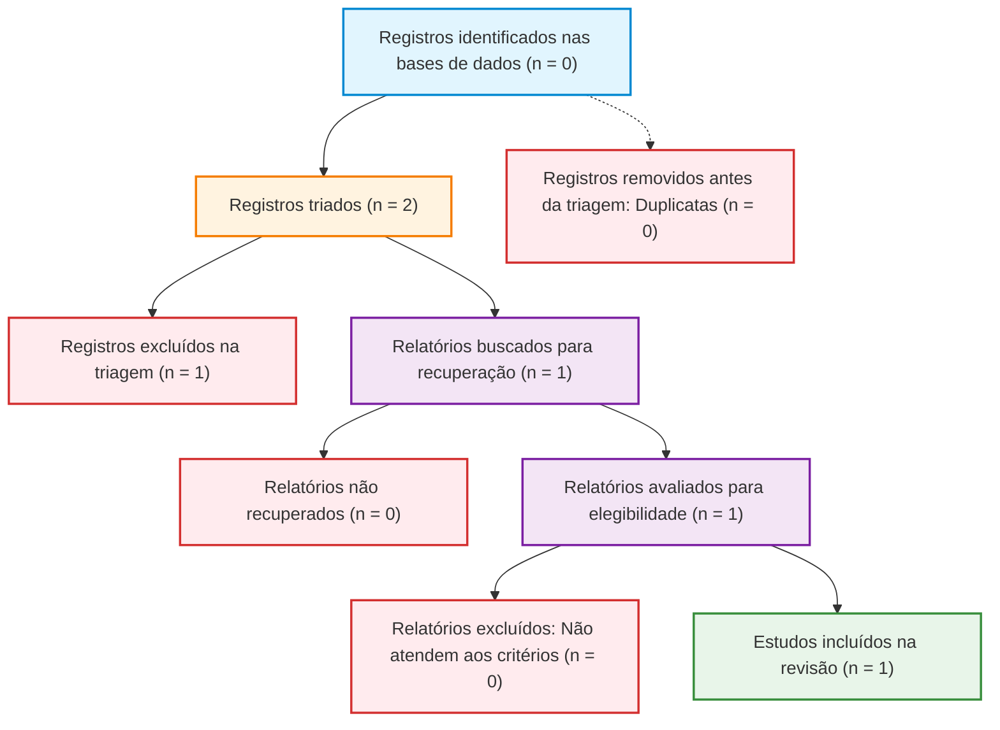

Mock Report Content

## Fluxograma PRISMA

```mermaid
flowchart TD
    %% Identificação
    Identified["Registros identificados nas bases de dados (n = 0)"]
    
    %% Triagem
    Screened["Registros triados (n = 2)"]
    Identified --> Screened
    
    Duplicates["Registros removidos antes da triagem: Duplicatas (n = 0)"]
    Identified -.-> Duplicates
    
    ExcludedScreening["Registros excluídos na triagem (n = 1)"]
    Screened --> ExcludedScreening
    
    %% Elegibilidade
    SoughtRetrieval["Relatórios buscados para recuperação (n = 1)"]
    Screened --> SoughtRetrieval
    
    NotRetrieved["Relatórios não recuperados (n = 0)"]
    SoughtRetrieval --> NotRetrieved
    
    AssessedElig["Relatórios avaliados para elegibilidade (n = 1)"]
    SoughtRetrieval --> AssessedElig
    
    ExcludedElig["Relatórios excluídos: Não atendem aos critérios (n = 0)"]
    AssessedElig --> ExcludedElig
    
    %% Inclusão
    Included["Estudos incluídos na revisão (n = 1)"]
    AssessedElig --> Included
    
    %% Estilização
    style Identified fill:#e1f5fe,stroke:#0288d1,stroke-width:2px
    style Screened fill:#fff3e0,stroke:#f57c00,stroke-width:2px
    style SoughtRetrieval fill:#f3e5f5,stroke:#7b1fa2,stroke-width:2px
    style AssessedElig fill:#f3e5f5,stroke:#7b1fa2,stroke-width:2px
    style Included fill:#e8f5e9,stroke:#388e3c,stroke-width:2px
    style ExcludedScreening fill:#ffebee,stroke:#d32f2f,stroke-width:2px
    style ExcludedElig fill:#ffebee,stroke:#d32f2f,stroke-width:2px
    style NotRetrieved fill:#ffebee,stroke:#d32f2f,stroke-width:2px
    style Duplicates fill:#ffebee,stroke:#d32f2f,stroke-width:2px
```