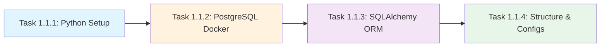

# 🏗️ Phase 1.1: Environment Setup (8h)

**GitHub Issue:** #001  
**Parent Milestone:** Fase 1 - Fundação (MVP + Core)  
**Estimated Time:** 8 hours  
**Dependencies:** None (Initial setup phase)  
**Owner:** Development Team  

---

## 📋 Overview

This initial setup phase establishes the foundational infrastructure required for the **Agents-Prisma** multi-agent system. We will configure Python 3.12+ with `uv`, set up PostgreSQL via Docker, implement SQLAlchemy ORM models, and establish project structure following GSD best practices.

### Success Criteria
- ✅ Python environment configured with CrewAI dependencies
- ✅ PostgreSQL container running and accessible
- ✅ SQLAlchemy database connection working
- ✅ Project directory structure created per PROJECT.md
- ✅ All verification commands pass without errors

---

## 🎯 Task Breakdown

### Task 1.1.1: Setup Python Environment (2h)
**Reference:** `PROJECT.md` lines 57-68, `PLAN.md` Phase 1  
**Goal:** Initialize development environment with `uv` package manager and CrewAI dependencies.

#### Commands:
```powershell
# Create virtual environment and sync dependencies
uv venv && uv sync

# Add core project dependencies (optimized for Python 3.12+)
uv add crewai crewai-tools sqlalchemy psycopg2-binary pytest pytest-mock

# Verify installations
uv pip list | Select-String -Pattern "crewai|sqlalchemy|psycopg"
python -c "import crewai; print(crewai.__version__)"
```

#### Acceptance Criteria:
- [ ] `uv` successfully creates virtual environment at `.venv/`
- [ ] All dependencies install without warnings
- [ ] Python imports work in both CLI and interactive mode
- [ ] Version constraints satisfied (CrewAI >= 0.7.0, SQLAlchemy >= 2.0)

---

### Task 1.1.2: Configure PostgreSQL Docker (2h)
**Reference:** `PROJECT.md` lines 30-35  
**Goal:** Stand up persistent PostgreSQL container with proper networking and environment configuration.

#### Files to Create:

**.env.example:**
```powershell
DB_HOST=localhost
DB_PORT=5432
DB_NAME=prisma_dev
DB_USER=postgres_user
DB_PASSWORD=secure_password_123
```

**docker-compose.yml:**
```yaml
version: '"'"'3.8'"'"'
services:
  agents-prisma-postgres-1:
    image: postgres:15-alpine
    container_name: agents-prisma-postgres-1
    environment:
      POSTGRES_USER: ${DB_USER}
      POSTGRES_PASSWORD: ${DB_PASSWORD}
      POSTGRES_DB: ${DB_NAME}
    ports:
      - "5432:5432"
    volumes:
      - postgres_data:/var/lib/postgresql/data
    healthcheck:
      test: ["CMD-SHELL", "pg_isready -U ${DB_USER}"]
      interval: 10s
      timeout: 5s
      retries: 5

volumes:
  postgres_data:
```

#### Commands:
```powershell
# Start container (if port 5432 in use, change port mapping or container name)
docker-compose up -d

# Verify container is running
docker ps | Select-Object -First 1

# Test connection
docker exec agents-prisma-postgres-1 pg_isready -U postgres_user
```

#### Acceptance Criteria:
- [ ] Container starts without errors
- [ ] Port 5432 bound and accessible locally
- [ ] Database `prisma_dev` created automatically
- [ ] Health check passes (container reports healthy)
- [ ] Connection string resolves successfully

---

### Task 1.1.3: Configure SQLAlchemy ORM (2h)
**Reference:** `PROJECT.md` lines 98-107, `PLAN.md` Section 1.1.3  
**Goal:** Create database models and connection utilities for PRISMA pipeline data persistence.

#### Files to Create:

**src/db/__init__.py:**
```python
"""Database initialization and model exports."""
from .models import Base, Project, Phase, Article

__all__ = ["Base", "Project", "Phase", "Article"]
```

**src/db/models.py:**
```python
"""SQLAlchemy ORM models for PRISMA pipeline data."""
from sqlalchemy import Column, Integer, String, Text, DateTime, ForeignKey, Boolean
from sqlalchemy.dialects.postgresql import JSONB
from datetime import datetime
import os
from urllib.parse import quote_plus

# Connection string builder (separate variables per Q4 decision)
def get_database_url():
    """Build PostgreSQL connection URL from environment variables."""
    DB_HOST = os.getenv("DB_HOST", "localhost")
    DB_PORT = int(os.getenv("DB_PORT", 5432))
    DB_NAME = os.getenv("DB_NAME", "prisma_dev")
    DB_USER = os.getenv("DB_USER", "postgres_user")
    DB_PASSWORD = os.getenv("DB_PASSWORD", "secure_password_123")
    
    return f"postgresql://{DB_USER}:{quote_plus(DB_PASSWORD)}@{DB_HOST}:{DB_PORT}/{DB_NAME}"

# Base class for all models
from sqlalchemy.orm import declarative_base
Base = declarative_base()

class Project(Base):
    """Top-level project representing a systematic review."""
    __tablename__ = "projects"
    
    id = Column(Integer, primary_key=True)
    name = Column(String(255), nullable=False)
    description = Column(Text, default="")
    created_at = Column(DateTime, default=datetime.utcnow)
    updated_at = Column(DateTime, default=datetime.utcnow, onupdate=datetime.utcnow)

class Phase(Base):
    """PRISMA phase tracking (Identification, Screening, etc.)."""
    __tablename__ = "phases"
    
    id = Column(Integer, primary_key=True)
    project_id = Column(Integer, ForeignKey("projects.id"), nullable=False)
    phase_name = Column(String(100), nullable=False)  # e.g., "Identification", "Screening"
    status = Column(String(50), default="pending")     # pending, in_progress, completed
    progress = Column(Integer, default=0)              # 0-100 percentage
    created_at = Column(DateTime, default=datetime.utcnow)
    
    def __repr__(self):
        return f"<Phase(name='"'"'{self.phase_name}', project_id={self.project_id}, status='"'"'{self.status}')>"

class Article(Base):
    """Individual article tracked through the PRISMA funnel."""
    __tablename__ = "articles"
    
    id = Column(Integer, primary_key=True)
    phase_id = Column(Integer, ForeignKey("phases.id"), nullable=False)
    doi = Column(String(255), unique=True, index=True)
    title = Column(Text, nullable=False)
    authors = Column(JSONB, default=list)
    abstract = Column(Text, default="")
    metadata = Column(JSONB, default=dict)  # Source (PubMed/Scopus/etc.), date added, etc.
    created_at = Column(DateTime, default=datetime.utcnow)
```

#### Commands:
```powershell
# Test database connection
python -c "import os; from urllib.parse import quote_plus; 
url = f\"postgresql://{os.getenv('"'"'DB_USER'"'"')}:{quote_plus(os.getenv('"'"'DB_PASSWORD'"'"'))}@{os.getenv('"'"'DB_HOST'"'"')}:{os.getenv('"'"'DB_PORT'"'"')}/{os.getenv('"'"'DB_NAME'"'"')}\";
print(f'Connection URL: {url}');
from sqlalchemy import create_engine; engine = create_engine(url); print('Engine created successfully!')"

# Verify models can be imported
python -c "import sys; sys.path.insert(0, '.'); from src.db.models import Project, Phase, Article; print('Models imported successfully!')"
```

#### Acceptance Criteria:
- [ ] `src/db/__init__.py` created with proper exports
- [ ] `src/db/models.py` contains all three model classes
- [ ] Connection string builder works from environment variables
- [ ] Models can be instantiated without errors
- [ ] Database connection test passes

---

### Task 1.1.4: Structure Directories & Configs (2h)
**Reference:** `PROJECT.md` lines 78-121  
**Goal:** Create project directory structure, configuration files, and GSD planning artifacts.

#### Files to Create:

**config/__init__.py:**
```python
"""Configuration module initialization."""
from .settings import Settings, get_settings

__all__ = ["Settings", "get_settings"]
```

**.planning/prisma_criteria.json (template):**
```json
{
  "version": "1.0.0",
  "project_name": "Agents-Prisma",
  "methodology": "PRISMA 2020",
  "stages": {
    "identification": {
      "databases": ["PubMed/Medline", "Scopus", "Web of Science", "Google Scholar"],
      "date_range_start": null,
      "date_range_end": null,
      "search_strategy": []
    },
    "screening": {
      "inclusion_criteria": [],
      "exclusion_criteria": []
    },
    "eligibility": {
      "language_restrictions": ["English", "Portuguese"],
      "study_designs_allowed": ["RCT", "Cohort", "Case-Control"]
    },
    "synthesis": {
      "output_formats": ["Markdown", "Obsidian-compatible", "JSON"]
    }
  },
  "custom_fields": {}
}
```

**Update `.gitignore` (add uv patterns):**
```powershell
# Add to existing .gitignore or create new one:
venv/
.env
.env.local
.pytest_cache/
.coverage
htmlcov/
*.pyc
__pycache__/
```

#### Acceptance Criteria:
- [ ] Directory structure matches `PROJECT.md` (lines 78-121)
- [ ] All config files created with proper Python imports
- [ ] `.planning/prisma_criteria.json` template populated
- [ ] `.gitignore` includes uv, pytest, and cache patterns

---

## 🔗 Dependencies & Sequencing



**Sequential Dependencies:**
- Task 1.1.2 requires Python dependencies from 1.1.1 (for later verification)
- Task 1.1.3 requires PostgreSQL running from 1.1.2
- Task 1.1.4 can run in parallel with 1.1.3 but should complete last

---

## ⚠️ Risk Analysis & Mitigation

| Risk | Probability | Impact | Mitigation |
|------|-------------|--------|------------|
| Port 5432 already in use | Medium | Low | Use unique container name `agents-prisma-postgres-1` (Q3 decision); fallback to different port if needed |
| Python version mismatch | Medium | High | Enforce `requires-python = ">=3.12"` per Q2 decision; verify with `python --version` before install |
| Docker not installed | Low | Medium | Document installation steps in GETTING-STARTED.md; provide alternative (Docker Desktop, Podman) |
| SQLAlchemy connection errors | High | High | Use separate DB variables (Q4); implement retry logic; add comprehensive error messages |

---

## 📊 Time Allocation Summary

| Task | Est. Time | Buffer | Total |
|------|-----------|--------|-------|
| 1.1.1: Python Environment | 2h | +30m | 2.5h |
| 1.1.2: PostgreSQL Docker | 2h | +45m | 2.75h |
| 1.1.3: SQLAlchemy ORM | 2h | +45m | 2.75h |
| 1.1.4: Structure & Configs | 2h | +30m | 2.5h |
| **Total** | **8h** | **+1.5h** | **9.5h** |

*Buffer time accounts for Docker restarts, dependency conflicts, and environment troubleshooting.*

---

## ✅ Deliverables Checklist

### Core Infrastructure:
- [ ] `.venv/` directory created with Python 3.12+ virtual environment
- [ ] `docker-compose.yml` configured with container name `agents-prisma-postgres-1`
- [ ] PostgreSQL container running and accessible on port 5432
- [ ] `.env.example` file with separate DB variables (Q4 decision)

### Python Dependencies:
- [ ] CrewAI installed (`crewai`, `crewai-tools`)
- [ ] SQLAlchemy ORM installed
- [ ] psycopg2-binary for PostgreSQL adapter
- [ ] pytest + pytest-mock for testing framework

### Database Layer:
- [ ] `src/db/__init__.py` with model exports
- [ ] `src/db/models.py` with Project/Phase/Article models
- [ ] Connection string builder using environment variables
- [ ] All models pass import verification

### Project Structure:
- [ ] `config/` directory created (for future settings module)
- [ ] `.planning/prisma_criteria.json` template populated
- [ ] `.gitignore` updated with uv patterns
- [ ] Directory structure matches `PROJECT.md` specification

---

## 🧪 Verification Commands

```powershell
# 1. Verify Python environment and dependencies
uv pip list | Select-String -Pattern "crewai|sqlalchemy"
python --version  # Should show >= 3.12

# 2. Test PostgreSQL connection
docker exec agents-prisma-postgres-1 pg_isready -U postgres_user

# 3. Verify SQLAlchemy models can be imported
cd src/db && python -c "from db.models import Project, Phase, Article; print('"'"'✓ Models OK'"'"')"

# 4. Run database connectivity test
python -c "
import sys; sys.path.insert(0, '.');
from sqlalchemy import create_engine; from urllib.parse import quote_plus
import os

url = f\"postgresql://{os.getenv('"'"'DB_USER'"'"')}:{quote_plus(os.getenv('"'"'DB_PASSWORD'"'"'))}@{os.getenv('"'"'DB_HOST'"'"')}:{os.getenv('"'"'DB_PORT'"'"')}/{os.getenv('"'"'DB_NAME'"'"')}\"
engine = create_engine(url)
with engine.connect() as conn:
    result = conn.execute('SELECT version();')
    print(f'✓ PostgreSQL {result.fetchone()[0]} connected successfully!')
"

# 5. Verify project structure (should show all expected directories)
tree -L 2 . | Select-String -Pattern "src/|config/|.planning/" | Select-Object -First 15
```

---

## 🚀 Next Steps After Completion

### Immediate:
1. **Create GitHub Issue #002** → Phase 1.2: Core Agent Implementation (Orchestrator + Searcher)
   - Implement `src/agents/orchestrator.py`
   - Integrate PubMed API tool (`src/tools/pubmed_tool.py`)
   - Set up CrewAI workflow pipeline

2. **Update ROADMAP.md** → Mark Phase 1.1 as completed, unblock Phase 1.2

3. **Create GETTING-STARTED.md** → Document setup process for new contributors

### Optional Enhancements (if time permits):
- Add SQLite fallback in `models.py` (for development without Docker)
- Implement Alembic migrations (`pip install alembic`)
- Write unit tests for database models

---

## 📚 Related Resources

- **PROJECT.md** (`.planning/PROJECT.md`, lines 57-121): Project context and architecture overview
- **PLAN.md Phase 1.1**: Detailed technical specifications (lines 83-96)
- **CrewAI Documentation**: https://docs.crewai.com/
- **SQLAlchemy Quickstart**: https://www.sqlalchemy.org/latest.html#quick-start
- **PRISMA 2020 Guidelines**: http://prisma-statement.org/

---

*Created: June 28, 2026  
Last Updated: [Auto-update via `/gsd:execute-phase`]*  
*Status: 🟡 In Progress → ⏳ Pending Review*